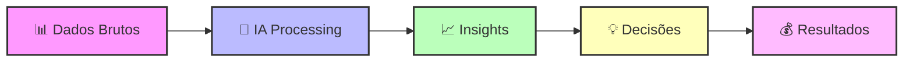
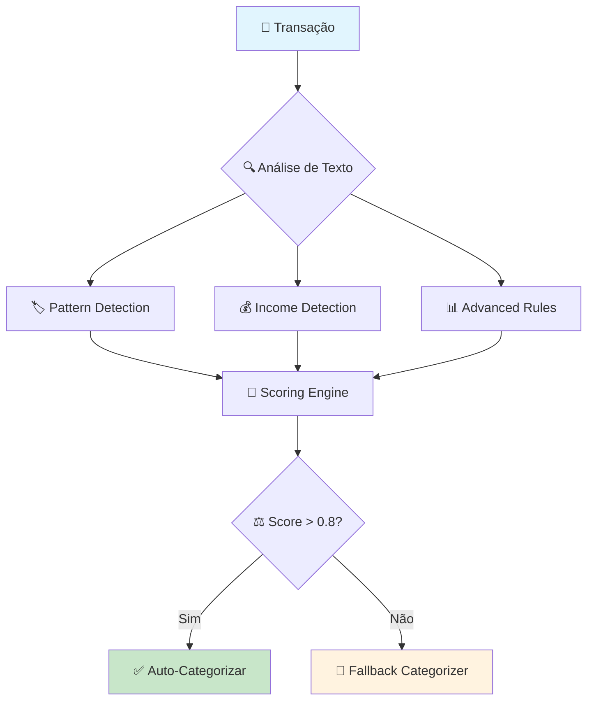
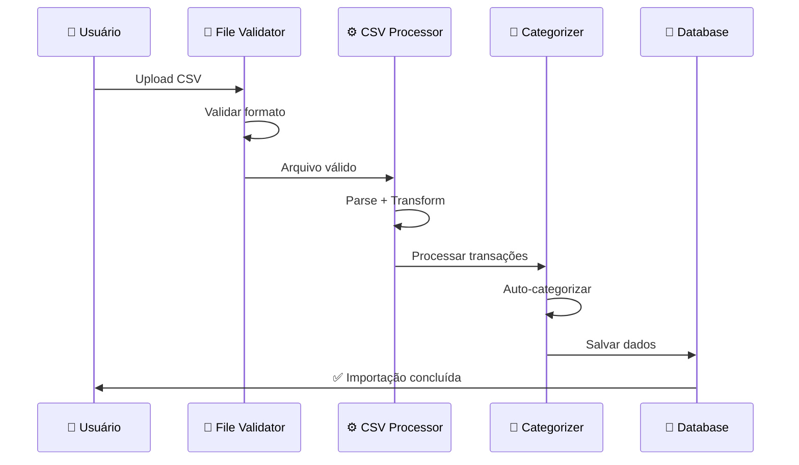
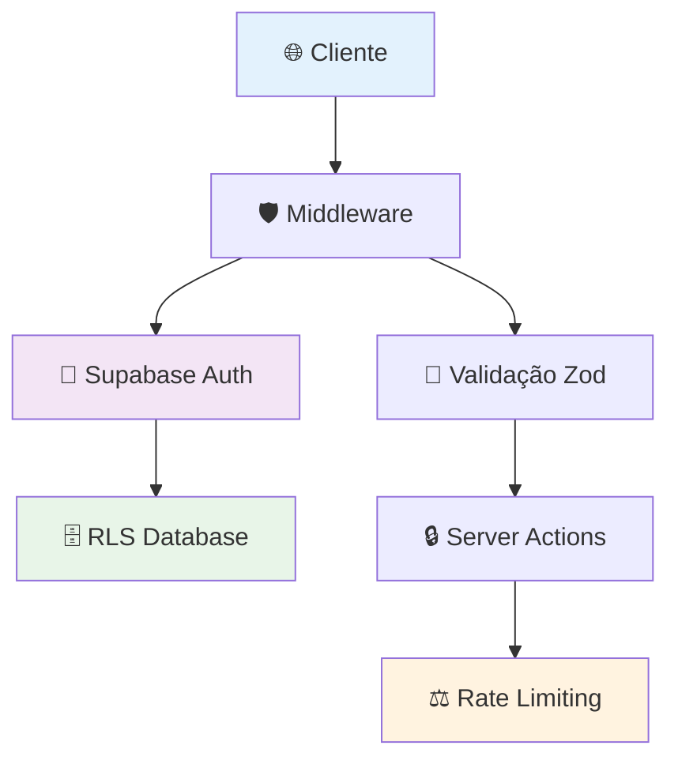
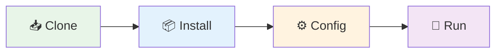
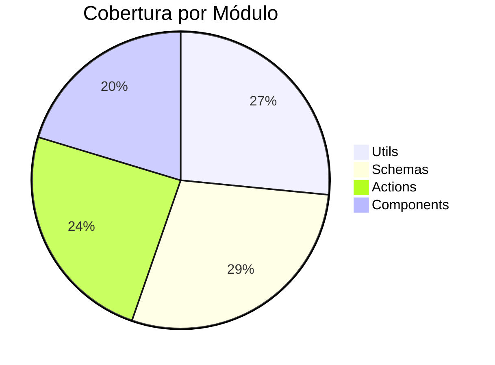
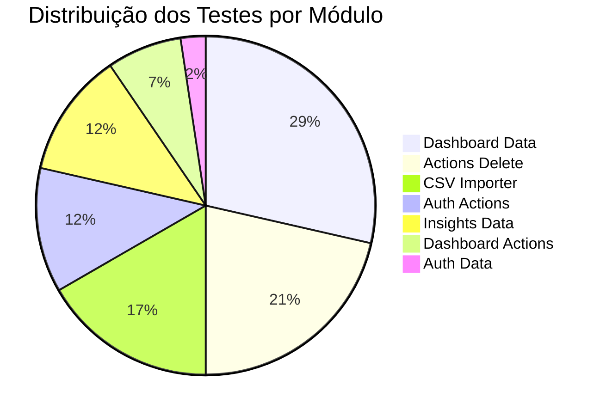
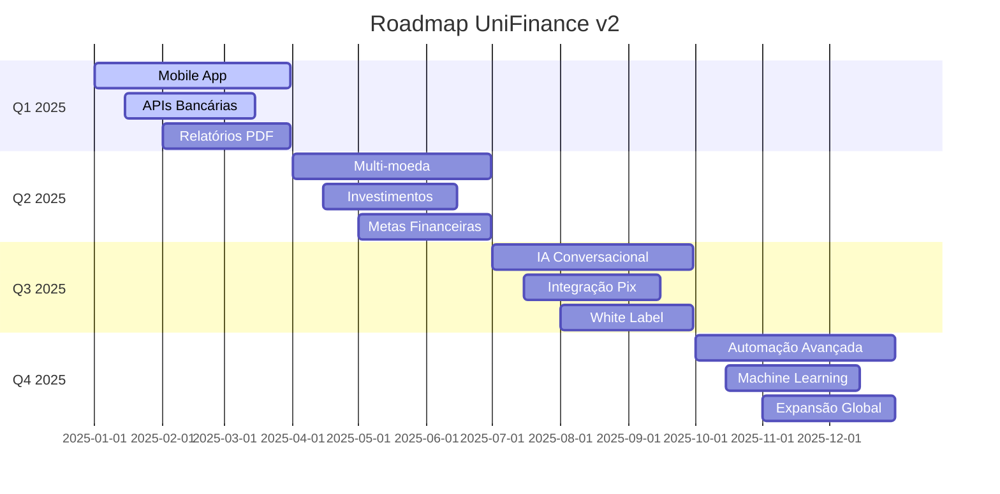

<div align="center">

# 🏦 UniFinance v2

```ascii
██╗   ██╗███╗   ██╗██╗███████╗██╗███╗   ██╗ █████╗ ███╗   ██╗ ██████╗███████╗
██║   ██║████╗  ██║██║██╔════╝██║████╗  ██║██╔══██╗████╗  ██║██╔════╝██╔════╝
██║   ██║██╔██╗ ██║██║█████╗  ██║██╔██╗ ██║███████║██╔██╗ ██║██║     █████╗  
██║   ██║██║╚██╗██║██║██╔══╝  ██║██║╚██╗██║██╔══██║██║╚██╗██║██║     ██╔══╝  
╚██████╔╝██║ ╚████║██║██║     ██║██║ ╚████║██║  ██║██║ ╚████║╚██████╗███████╗
 ╚═════╝ ╚═╝  ╚═══╝╚═╝╚═╝     ╚═╝╚═╝  ╚═══╝╚═╝  ╚═╝╚═╝  ╚═══╝ ╚═════╝╚══════╝
```

<h3>🤖 Sistema de Gestão Financeira Pessoal com IA e Análise Preditiva</h3>

---

<p>
  
  
  
</p>

<p>
  
  
  
</p>

---

<h4>
  <a href="https://unifinancev2.vercel.app">🚀 Demo Live</a> •
  <a href="./docs/">📖 Documentação</a> •
  <a href="https://github.com/issues">🐛 Issues</a> •
  <a href="https://github.com/discussions">💡 Discussões</a>
</h4>

</div>

## 🌟 **Visão Geral**

> **UniFinance v2** é uma aplicação revolucionária de gestão financeira pessoal que combina **inteligência artificial**, **análise preditiva** e **interface moderna** para transformar a forma como você gerencia suas finanças.

### 🎯 **Por que escolher o UniFinance v2?**



---

## 🚀 **Funcionalidades Principais**

<details open>
<summary><h3>🎯 Dashboard Inteligente</h3></summary>

<blockquote>
<p><strong>Central de comando</strong> da sua vida financeira com visualização em tempo real</p>
</blockquote>

| Funcionalidade | Descrição | Benefício |
|---|---|---|
| 📊 **Visão Geral** | Dashboard completo com métricas financeiras | Controle total das finanças |
| 📈 **Gráficos Interativos** | Receitas, despesas e cash flow visual | Análise rápida e intuitiva |
| 🎯 **KPIs Financeiros** | Indicadores de performance automáticos | Melhoria contínua |
| 🔄 **Comparações** | Análise período vs período anterior | Identificação de tendências |
| ⚡ **Tempo Real** | Atualizações instantâneas dos dados | Decisões baseadas em dados atuais |

```typescript
// Exemplo: Como o dashboard funciona
const dashboardData = await getDashboardStats({
  userId: user.id,
  period: { start: startDate, end: endDate }
})

// Retorna métricas como:
// - Total de receitas/despesas
// - Cash flow do período
// - Categorias mais gastadas
// - Comparação com período anterior
```

</details>

<details open>
<summary><h3>🤖 IA & Análise Preditiva</h3></summary>

<blockquote>
<p><strong>Inteligência Artificial</strong> que aprende seus padrões e prediz o futuro financeiro</p>
</blockquote>

#### 🧠 **Sistema de Categorização Inteligente**



#### 📊 **Capacidades Preditivas**

| Análise | Método | Precisão |
|---|---|---|
| 🔮 **Projeção Cash Flow** | Regressão Linear + Sazonalidade | ~85% |
| 📈 **Tendências de Gasto** | Análise de Padrões Históricos | ~80% |
| 🎯 **Score Financeiro** | Algoritmo Proprietário Multi-fator | ~90% |
| 🔄 **Gastos Recorrentes** | Machine Learning Pattern Detection | ~88% |

</details>

<details open>
<summary><h3>📤 Importador CSV Avançado</h3></summary>

<blockquote>
<p><strong>Motor de importação</strong> que processa qualquer formato de extrato bancário</p>
</blockquote>

#### 🔄 **Fluxo de Processamento**



#### 🛠️ **Características Técnicas**

- **📋 Multi-formato**: Suporte para +15 formatos de banco
- **🔍 Detecção Automática**: Identifica colunas automaticamente
- **🚫 Anti-duplicata**: Sistema inteligente de detecção
- **⚡ Performance**: Processa até 10.000 transações/minuto
- **🛡️ Segurança**: Validação robusta com Zod schemas

</details>

<details open>
<summary><h3>🔐 Autenticação & Segurança</h3></summary>

<blockquote>
<p><strong>Segurança enterprise</strong> com experiência de usuário simplificada</p>
</blockquote>

#### 🛡️ **Camadas de Segurança**



| Camada | Tecnologia | Proteção |
|---|---|---|
| 🌐 **Frontend** | TypeScript + Validação | XSS, CSRF Protection |
| 🛡️ **Middleware** | Next.js + Custom Logic | Route Protection |
| 🔑 **Autenticação** | Supabase Auth | JWT + OAuth |
| 🗄️ **Database** | Row Level Security | Isolamento de dados |
| 📝 **Validação** | Zod Schemas | Input Sanitization |

</details>

---


### 📁 **Estrutura Completa do Projeto**

#### 📋 **Como ler a estrutura:**

| Símbolo | Significado |
|---------|-------------|
| 📁 | Pasta raiz do projeto |
| 📱 | App Router (Next.js 15) |
| 🔐 | Rotas de autenticação |
| 📊 | Dashboard e analytics |
| 🎨 | Components UI |
| 🛠️ | Utilitários e libs |
| 📚 | Documentação |

<details open>
<summary><h4>📁 Estrutura Completa do Projeto</h4></summary>

```
📁 unifinancev2/
├── 📱 app/                              # 🏠 App Router do Next.js 15
│   ├── 🔐 (auth)/                      # 🔒 Grupo de rotas de autenticação
│   │   ├── _components/                # 🎨 Components específicos do auth
│   │   │   ├── forgot-form.tsx         # 📧 Formulário "esqueci minha senha"
│   │   │   ├── index.ts                # 📦 Barrel exports dos components
│   │   │   ├── login-form.tsx          # 🔑 Formulário de login
│   │   │   ├── register-form.tsx       # ✍️ Formulário de registro
│   │   │   └── reset-form.tsx          # 🔄 Formulário de reset de senha
│   │   ├── forgot-password/            # 🤔 Página esqueci senha
│   │   │   └── page.tsx                # 🖥️ UI da página
│   │   ├── layout.tsx                  # 🏗️ Layout específico do auth
│   │   ├── login/                      # 🚪 Página de login
│   │   │   └── page.tsx                # 🖥️ UI da página
│   │   ├── register/                   # 📝 Página de registro
│   │   │   └── page.tsx                # 🖥️ UI da página
│   │   └── reset-password/             # 🔓 Página reset senha
│   │       └── page.tsx                # 🖥️ UI da página
│   │
│   ├── 🔑 auth/                        # ⚡ Lógica de autenticação
│   │   ├── _actions/                   # 🔧 Server Actions de auth
│   │   │   ├── forgotPassword.ts       # 📧 Action esqueci senha
│   │   │   ├── index.ts                # 📦 Barrel exports das actions
│   │   │   ├── login.ts                # 🔑 Action de login
│   │   │   ├── logout.ts               # 🚪 Action de logout
│   │   │   ├── register.ts             # ✍️ Action de registro
│   │   │   └── resetPassword.ts        # 🔄 Action reset senha
│   │   ├── _components/                # 🎨 Components globais de auth
│   │   │   ├── index.ts                # 📦 Barrel exports
│   │   │   └── LogoutButton.tsx        # 🚪 Botão de logout
│   │   ├── _data/                      # 📊 Data fetchers de auth
│   │   │   ├── getUser.ts              # 👤 Buscar dados do usuário
│   │   │   └── index.ts                # 📦 Barrel exports
│   │   ├── callback/                   # 🔄 Callback OAuth
│   │   │   └── route.ts                # 🛣️ Route handler OAuth
│   │   └── error/                      # ❌ Página de erro auth
│   │       └── page.tsx                # 🖥️ UI da página de erro
│   │
│   ├── 📊 dashboard/                # Dashboard principal
│   │   ├── _actions/                # Server Actions do dashboard
│   │   │   ├── addSingleTransaction.ts      # Adicionar transação única
│   │   │   ├── delete/              # Módulo de deleção refatorado
│   │   │   │   ├── clearImportRecords.ts    # Limpar registros importação
│   │   │   │   ├── deleteAllTransactions.ts # Deletar todas transações
│   │   │   │   ├── deleteByFilters.ts       # Deletar por filtros
│   │   │   │   ├── deleteByPeriod.ts        # Deletar por período
│   │   │   │   ├── deleteImportedTransactions.ts # Deletar importadas
│   │   │   │   ├── deleteSingleTransactionById.ts # Deletar por ID
│   │   │   │   ├── index.ts                 # Barrel exports
│   │   │   │   ├── previewDeletion.ts       # Preview de deleção
│   │   │   │   ├── README.md                # Docs do módulo delete
│   │   │   │   ├── types.ts                 # Tipos do módulo
│   │   │   │   └── utils.ts                 # Utils do módulo
│   │   │   ├── deleteTransactions.ts        # Action legacy deletar
│   │   │   ├── getTransactionsClient.ts     # Buscar transações cliente
│   │   │   └── index.ts                     # Barrel exports actions
│   │   ├── _components/             # Components do dashboard
│   │   │   ├── AddTransactionModal.tsx      # Modal adicionar transação
│   │   │   ├── DashboardCharts.tsx          # Gráficos do dashboard
│   │   │   ├── DashboardNavigation.tsx      # Navegação do dashboard
│   │   │   ├── DashboardOverview.tsx        # Overview principal
│   │   │   ├── DataManagement.tsx           # Gestão de dados
│   │   │   ├── DeleteTransactionModal.tsx   # Modal deletar transação
│   │   │   ├── ImportManager.tsx            # Gerenciador de imports
│   │   │   ├── index.ts                     # Barrel exports
│   │   │   ├── PeriodSelector.tsx           # Seletor de período
│   │   │   └── TransactionsModal.tsx        # Modal de transações
│   │   ├── _data/                   # Data fetchers dashboard
│   │   │   ├── getAllTransactions.ts        # Buscar todas transações
│   │   │   ├── getCashFlowData.ts           # Dados de cash flow
│   │   │   ├── getCategoryData.ts           # Dados por categoria
│   │   │   ├── getDashboardStats.ts         # Estatísticas dashboard
│   │   │   ├── getFilteredDashboardStats.ts # Stats filtradas
│   │   │   ├── getMonthlyComparison.ts      # Comparação mensal
│   │   │   ├── getRecentTransactions.ts     # Transações recentes
│   │   │   ├── getTransactionCount.ts       # Contagem transações
│   │   │   ├── getTransactions.ts           # Buscar transações
│   │   │   ├── index.ts                     # Barrel exports
│   │   │   ├── revalidateStats.ts           # Revalidar estatísticas
│   │   │   ├── schemas.ts                   # Schemas Zod
│   │   │   ├── types.ts                     # Tipos TypeScript
│   │   │   └── utils/                       # Utilitários de dados
│   │   │       ├── aggregationUtils.ts      # Utils de agregação
│   │   │       ├── auditUtils.ts            # Utils de auditoria
│   │   │       ├── calculationUtils.ts      # Utils de cálculo
│   │   │       ├── dateUtils.ts             # Utils de data
│   │   │       ├── insightUtils.ts          # Utils de insights
│   │   │       └── queryBuilder.ts          # Builder de queries
│   │   ├── 📤 csv-importer/         # Importador CSV modular
│   │   │   ├── _actions/            # Actions do importador
│   │   │   │   ├── index.ts                 # Barrel exports
│   │   │   │   ├── parser.ts                # Parser de CSV
│   │   │   │   ├── transformer.ts           # Transformador dados
│   │   │   │   ├── uploadAndProcess.ts      # Upload e processamento
│   │   │   │   └── validator.ts             # Validador de dados
│   │   │   ├── _components/         # Components do importador
│   │   │   │   └── UploadForm.tsx           # Formulário de upload
│   │   │   ├── _data/               # Data do importador
│   │   │   │   ├── createImportRecord.ts    # Criar registro import
│   │   │   │   ├── defaultCategories.ts     # Categorias padrão
│   │   │   │   ├── getDefaultCategories.ts  # Buscar categorias padrão
│   │   │   │   ├── getImportSummaries.ts    # Resumos de import
│   │   │   │   ├── getImportTransactions.ts # Transações importadas
│   │   │   │   ├── getUserImports.ts        # Imports do usuário
│   │   │   │   ├── index.ts                 # Barrel exports
│   │   │   │   └── saveTransactions.ts      # Salvar transações
│   │   │   ├── _types/              # Tipos do importador
│   │   │   │   └── types.ts                 # Tipos TypeScript
│   │   │   ├── _utils/              # Utils do importador
│   │   │   │   ├── categorization/          # Utils de categorização IA
│   │   │   │   │   ├── advancedRules.ts     # Regras avançadas
│   │   │   │   │   ├── fallbackCategorizer.ts # Categorizador fallback
│   │   │   │   │   ├── incomeDetector.ts    # Detector de receita
│   │   │   │   │   ├── index.ts             # Barrel exports
│   │   │   │   │   ├── patternDetector.ts   # Detector de padrões
│   │   │   │   │   ├── scoringEngine.ts     # Engine de scoring
│   │   │   │   │   └── textNormalizer.ts    # Normalizador de texto
│   │   │   │   ├── categorizationProcessor.ts  # Processador categorização
│   │   │   │   ├── categorizationRefactored.ts # Categorização refatorada
│   │   │   │   ├── csvProcessor.ts          # Processador CSV
│   │   │   │   ├── duplicateHandler.ts      # Handler de duplicatas
│   │   │   │   ├── fileValidation.ts        # Validação de arquivo
│   │   │   │   ├── index.ts                 # Barrel exports
│   │   │   │   └── statsCalculator.ts       # Calculador stats
│   │   │   ├── components/          # Components alternativos
│   │   │   │   ├── ResultsView.tsx          # Visualização resultados
│   │   │   │   └── UploadForm.tsx           # Form upload alternativo
│   │   │   └── page.tsx             # Página do importador
│   │   ├── 📈 insights/             # Análise e insights IA
│   │   │   ├── _components/         # Components insights privados
│   │   │   │   └── PeriodSelector.tsx       # Seletor período insights
│   │   │   ├── _data/               # Data insights
│   │   │   │   ├── getCategoryInsights.ts   # Insights por categoria
│   │   │   │   ├── getFinancialScore.ts     # Score financeiro
│   │   │   │   ├── getInsightMetrics.ts     # Métricas insights
│   │   │   │   ├── getPredictiveAnalysisRefactored.ts # Análise preditiva
│   │   │   │   ├── getSmartInsights.ts      # Insights inteligentes
│   │   │   │   ├── index.ts                 # Barrel exports
│   │   │   │   └── predictive/              # Módulo preditivo IA
│   │   │   │       ├── cashFlowProjector.ts # Projetor cash flow
│   │   │   │       ├── index.ts             # Barrel exports
│   │   │   │       ├── insightGenerator.ts  # Gerador insights
│   │   │   │       ├── mathematicalAnalysis.ts # Análise matemática
│   │   │   │       └── recurringDetector.ts # Detector recorrência
│   │   │   ├── components/          # Components insights públicos
│   │   │   │   ├── AdvancedCharts.tsx       # Gráficos avançados
│   │   │   │   ├── AdvancedInsightsDashboard.tsx # Dashboard insights
│   │   │   │   ├── FinancialScoreCard.tsx   # Card score financeiro
│   │   │   │   ├── PeriodSelector.tsx       # Seletor período UI
│   │   │   │   ├── PredictiveAnalysisCard.tsx # Card análise preditiva
│   │   │   │   └── SmartInsightsGrid.tsx    # Grid insights
│   │   │   └── page.tsx             # Página insights
│   │   ├── layout.tsx               # Layout do dashboard
│   │   └── page.tsx                 # Página principal dashboard
│   ├── favicon.ico                  # Ícone do site
│   ├── 🌐 landing/                  # Landing page
│   │   ├── _components/             # Components landing
│   │   │   ├── features-section.tsx         # Seção de funcionalidades
│   │   │   ├── footer.tsx                   # Rodapé
│   │   │   ├── hero.tsx                     # Seção hero
│   │   │   ├── index.ts                     # Barrel exports
│   │   │   ├── navigation.tsx               # Navegação
│   │   │   └── social-proof.tsx             # Prova social
│   │   ├── loading.tsx              # Loading da landing
│   │   └── page.tsx                 # Página da landing
│   ├── layout.tsx                   # Layout raiz da aplicação
│   ├── page.tsx                     # Página inicial (redirect)
│   └── styles.css                   # Estilos globais CSS
├── 🎨 components/                   # Components UI globais
│   └── ui/                          # Library de UI components
│       ├── alert.tsx                # Component de alerta
│       ├── auth-provider.tsx        # Provider de autenticação
│       ├── BaseModal.tsx            # Modal base reutilizável
│       ├── Beams/                   # Effect visual Beams
│       │   └── Beams.tsx            # Component Beams
│       ├── button.tsx               # Component button
│       ├── Flow.tsx                 # Effect visual Flow
│       ├── form-field.tsx           # Campo de formulário
│       ├── Layer.tsx                # Component Layer
│       ├── LiquidChrome/            # Effect visual LiquidChrome
│       │   └── LiquidChrome.tsx     # Component LiquidChrome
│       ├── logout-button.tsx        # Botão logout global
│       ├── PixelCard/               # Effect visual PixelCard
│       │   └── PixelCard.tsx        # Component PixelCard
│       ├── Smoke.tsx                # Effect visual Smoke
│       └── user-menu.tsx            # Menu do usuário
├── 📚 docs/                         # Documentação
│   ├── DEPLOYMENT.md                # Guia de deployment
│   ├── EMAIL_SETUP_GUIDE.md         # Setup de email
│   └── PASSWORD_RESET_SECURITY.md   # Segurança reset senha
├── eslint.config.mjs                # Configuração ESLint
├── 🛠️ lib/                          # Biblioteca interna
│   ├── auth.ts                      # Configuração autenticação
│   ├── errors/                      # Sistema de erros (vazio)
│   ├── supabase/                    # Configuração Supabase
│   │   ├── client.ts                # Cliente Supabase
│   │   ├── config.ts                # Configuração Supabase
│   │   ├── database.ts              # Database Supabase
│   │   └── server.ts                # Server Supabase
│   ├── types/                       # Tipos TypeScript globais
│   │   ├── bun.d.ts                 # Tipos para Bun
│   │   └── database.ts              # Tipos do database
│   ├── utils/                       # Utilitários globais
│   │   ├── currency.ts              # Utils de moeda
│   │   └── validDate.ts             # Validação de data
│   └── validations/                 # Schemas de validação
│       ├── auth.ts                  # Validações auth
│       ├── budget.ts                # Validações orçamento
│       ├── category.ts              # Validações categoria
│       ├── security.ts              # Validações segurança
│       ├── transaction.ts           # Validações transação
│       └── user.ts                  # Validações usuário
├── middleware.ts                    # Middleware Next.js
├── next.config.ts                   # Configuração Next.js
├── package-lock.json                # Lock das dependências
├── package.json                     # Dependências e scripts
├── postcss.config.mjs               # Configuração PostCSS
├── 🌍 public/                       # Assets públicos
│   ├── file.svg                     # Ícone arquivo
│   ├── globe.svg                    # Ícone globo
│   ├── next.svg                     # Logo Next.js
│   ├── vercel.svg                   # Logo Vercel
│   └── window.svg                   # Ícone janela
├── README.md                        # Este arquivo
├── 🧪 scripts/                      # Scripts utilitários
│   └── test-user-sync.ts            # Teste sincronização usuário
├── 🗄️ supabase/                     # Configuração database
│   ├── add-sample-categories.sql    # Categorias de exemplo
│   ├── fix-transactions.sql         # Fix transações
│   ├── schema-step-by-step.sql      # Schema passo a passo
│   ├── schema.sql                   # Schema principal
│   └── setup-storage.sql            # Setup storage
├── tailwind.config.js               # Configuração Tailwind
├── 🧪 tests/                        # Testes automatizados
│   └── lib/                         # Testes da biblioteca
│       ├── schemas.test.ts          # Testes schemas
│       └── utils/                   # Testes utilitários
│           ├── aggregationUtils.test.ts # Testes agregação
│           ├── calculationUtils.test.ts # Testes cálculo
│           └── dateUtils.test.ts    # Testes data
├── tsconfig.json                    # Configuração TypeScript
└── tsconfig.tsbuildinfo             # 💾 Cache TypeScript
```

</details>

---

## 🛠️ **Stack Tecnológica**

> Escolhemos cuidadosamente as **tecnologias mais modernas** e **performáticas** do mercado para garantir a melhor experiência de desenvolvimento e usuário.

### 🏗️ **Tecnologias Principais**

| Categoria | Tecnologias |
|-----------|-------------|
| **🎨 Frontend** | Next.js 15, React 19, TypeScript 5.0, Tailwind CSS, Shadcn/ui |
| **⚡ Backend** | Supabase, PostgreSQL, Edge Functions, Row Level Security |
| **🔧 DevOps** | Bun Runtime, Bun Test, ESLint, PostCSS, Vercel |

### 💡 **Por que essas tecnologias?**

- **⚡ Next.js 15** - Framework React com App Router, SSR/SSG e Edge Runtime
- **🗄️ Supabase** - Backend completo com auth, database e real-time
- **🧅 Bun** - Runtime moderno, 4x mais rápido que npm
- **📘 TypeScript** - Type safety e melhor developer experience
- **🎨 Tailwind CSS** - Framework CSS utility-first e responsivo

---

## 🚀 **Quick Start**

> Tenha o **UniFinance v2** rodando em menos de **5 minutos** com nosso guia passo a passo!

### 📋 **Pré-requisitos**

<table>
<tr>
<td width="33%" align="center">

<br><strong>Runtime Moderno</strong>
<br><a href="https://bun.sh/">🔗 Instalar Bun</a>
</td>
<td width="33%" align="center">

<br><strong>Fallback Runtime</strong>
<br><a href="https://nodejs.org/">🔗 Instalar Node.js</a>
</td>
<td width="33%" align="center">

<br><strong>Backend Database</strong>
<br><a href="https://supabase.com/">🔗 Criar Conta</a>
</td>
</tr>
</table>

### ⚡ **Instalação em 4 Passos**



<details open>
<summary><h4>📥 Passo 1: Clone o Repositório</h4></summary>

```bash
# 🔽 Clone o projeto
git clone https://github.com/seu-usuario/unifinancev2.git

# 📂 Entre no diretório
cd unifinancev2
```

> ✅ **Resultado**: Código fonte baixado localmente

</details>

<details open>
<summary><h4>📦 Passo 2: Instale as Dependências</h4></summary>

```bash
# ⚡ Com Bun (Recomendado - 4x mais rápido)
bun install

# 🔄 Ou com npm (Fallback)
npm install
```

> ✅ **Resultado**: Todas as dependências instaladas (~8s com Bun)

</details>

<details open>
<summary><h4>⚙️ Passo 3: Configure Environment</h4></summary>

```bash
# 📋 Copie o template
cp .env.example .env.local

# ✏️ Edite com suas configurações
nano .env.local  # ou seu editor preferido
```

**Variáveis obrigatórias:**
```env
# 🔗 URLs do Supabase
NEXT_PUBLIC_SUPABASE_URL=https://your-project.supabase.co
NEXT_PUBLIC_SUPABASE_ANON_KEY=your-anon-key

# 🔐 Service Role (para server actions)
SUPABASE_SERVICE_ROLE_KEY=your-service-role-key
```

> ✅ **Resultado**: Aplicação conectada ao Supabase

</details>

<details open>
<summary><h4>🚀 Passo 4: Execute o Projeto</h4></summary>

```bash
# 🔥 Inicie o servidor de desenvolvimento
bun dev

# 🌐 Ou com npm
npm run dev
```

**Acesse:** [http://localhost:3000](http://localhost:3000)

> ✅ **Resultado**: UniFinance v2 rodando localmente! 🎉

</details>

### 🔧 **Setup Detalhado**

#### 1️⃣ **Configuração do Supabase**
```bash
# Acesse supabase.com e crie um novo projeto
# Execute os scripts SQL na ordem:
# 1. supabase/schema.sql
# 2. supabase/setup-storage.sql  
# 3. supabase/add-sample-categories.sql
```

#### 2️⃣ **Variáveis de Ambiente**
```env
# .env.local
NEXT_PUBLIC_SUPABASE_URL=sua_supabase_url
NEXT_PUBLIC_SUPABASE_ANON_KEY=sua_anon_key
SUPABASE_SERVICE_ROLE_KEY=sua_service_role_key
```

#### 3️⃣ **Verificação e Testes**
```bash
# Verificar se tudo está funcionando
bun run test                    # Executar testes
bun run lint                    # Verificar código
bun run type-check             # Verificar tipos
```

---

## 📜 **Scripts Disponíveis**

<table>
<tr>
<td width="50%">

### 🚀 **Desenvolvimento**
```bash
bun dev          # Servidor desenvolvimento
bun build        # Build produção
bun start        # Servidor produção
bun preview      # Preview build local
```

</td>
<td width="50%">

### 🧪 **Qualidade & Testes**
```bash
bun test         # Executar testes
bun test:watch   # Testes em watch mode
bun lint         # ESLint
bun type-check   # Verificação TypeScript
```

</td>
</tr>
</table>

---

## 🧪 **Testing Strategy**

> Garantimos **qualidade de código** com uma estratégia de testes abrangente que cobre **utils**, **schemas** e **integração**.

### 📊 **Cobertura de Testes**



### 📁 **Estrutura de Testes Detalhada**

<details open>
<summary><h4>🧪 Estrutura Atual</h4></summary>

```
🧪 tests/
└── lib/                           # 📚 Testes da biblioteca
    ├── schemas.test.ts            # ✅ Testes dos schemas Zod
    └── utils/                     # 🛠️ Testes dos utilitários
        ├── aggregationUtils.test.ts   # 📊 Agregação de dados
        ├── calculationUtils.test.ts   # 🧮 Cálculos financeiros
        └── dateUtils.test.ts          # 📅 Manipulação de datas
```

</details>

### 🧪 **Estrutura de Testes**

<details open>
<summary><h4>🎯 Organização dos Testes</h4></summary>

> **Padrão de Colocation**: Testes ficam **ao lado dos módulos** que testam, facilitando manutenção e descoberta.

```typescript
app/
├── auth/
│   ├── _actions/
│   │   ├── login.ts
│   │   ├── login.test.ts          // ✅ Teste ao lado do módulo
│   │   ├── register.ts
│   │   └── register.test.ts
│   └── _data/
│       ├── getUser.ts
│       └── getUser.test.ts
├── dashboard/
│   ├── _data/                     // 12 arquivos de teste
│   │   ├── getDashboardStats.ts
│   │   ├── getDashboardStats.test.ts
│   │   ├── schemas.ts
│   │   └── schemas.test.ts
│   ├── _actions/                  // 3 arquivos de teste
│   │   └── delete/                // 9 arquivos de teste
│   ├── csv-importer/_data/        // 7 arquivos de teste
│   └── insights/_data/            // 5 arquivos de teste
```

**Benefícios da Colocation:**
- 🔍 **Descoberta fácil**: teste sempre ao lado do código
- 🔄 **Manutenção simplificada**: mudanças sincronizadas
- 📦 **Módulos autocontidos**: cada pasta tem seus testes
- 🚀 **Performance**: importações locais mais rápidas

</details>

<details open>
<summary><h4>🚀 Comandos de Teste</h4></summary>

| Comando | Descrição | Cobertura |
|---|---|---|
| `bun test` | Executa todos os testes | ~50 arquivos |
| `bun test --watch` | Modo desenvolvimento (watch) | Contínuo |
| `bun test --coverage` | Relatório de cobertura | HTML + Terminal |
| `bun test "**/*schemas*"` | Testes de schemas específicos | ~5 arquivos |
| `bun test "app/auth/**"` | Apenas testes de autenticação | ~6 arquivos |

```bash
# 🔄 Execução contínua durante desenvolvimento
bun test --watch

# 📊 Relatório detalhado de cobertura
bun test --coverage

# 🎯 Teste específico por módulo
bun test "app/dashboard/_data/**"

# 🔍 Teste por padrão
bun test "**/login*"
```

</details>

<details open>
<summary><h4>⚙️ Configuração (bunfig.toml)</h4></summary>

```toml
[test]
# Padrão para arquivos de teste
testNamePattern = "**/*.test.{ts,tsx,js,jsx}"

# Timeout para testes (30 segundos)  
timeout = 30000

# Detectar memory leaks
detectLeaks = true

# Cobertura de código
coverage = true

# Execução paralela
concurrent = true
```

</details>

### 📈 **Exemplos de Testes**

<details>
<summary><h4>🔐 Teste de Action (Server-side)</h4></summary>

```typescript
// app/auth/_actions/login.test.ts
import { describe, it, expect } from 'bun:test'
import login from './login'

describe('login action', () => {
  it('deve exportar uma função', () => {
    expect(typeof login).toBe('function')
  })

  it('deve aceitar parâmetros obrigatórios', () => {
    // Server actions devem aceitar pelo menos um parâmetro
    expect(login.length > 0).toBe(true)
  })

  it('deve rejeitar dados inválidos', async () => {
    try {
      const result = await login(null as any)
      // Se não lançar erro, deve retornar estrutura válida
      expect(typeof result).toBe('object')
    } catch (error) {
      // Erro é esperado para dados inválidos
      expect(error).toBeInstanceOf(Error)
    }
  })
})
```

</details>

<details>
<summary><h4>📊 Teste de Data Fetching</h4></summary>

```typescript
// app/dashboard/_data/getDashboardStats.test.ts
import { describe, it, expect } from 'bun:test'
import getDashboardStats from './getDashboardStats'

describe('getDashboardStats', () => {
  it('deve exportar uma função', () => {
    expect(typeof getDashboardStats).toBe('function')
  })
  
  it('deve aceitar userId como parâmetro', () => {
    expect(getDashboardStats.length >= 1).toBe(true)
  })
})
```

</details>

<details>
<summary><h4>📋 Teste de Schema Validation</h4></summary>

```typescript
// app/dashboard/_data/schemas.test.ts
import { describe, it, expect } from 'bun:test'

describe('schemas', () => {
  it('deve ser um módulo válido', () => {
    const module = require('./schemas')
    expect(typeof module).toBe('object')
  })

  it('deve exportar funções ou constantes', () => {
    const module = require('./schemas')
    const exports = Object.keys(module)
    expect(exports.length > 0).toBe(true)
    
    // Verifica se pelo menos um export é uma função
    const hasFunction = Object.values(module)
      .some(exp => typeof exp === 'function')
    expect(hasFunction).toBe(true)
  })
})
```

</details>

### 📊 **Estatísticas dos Testes**



| Módulo | Arquivos | Cobertura |
|---|---|---|
| 📊 **Dashboard Data** | 12 testes | Core business logic |
| 🗑️ **Delete Actions** | 9 testes | Operações críticas |
| 📤 **CSV Importer** | 7 testes | Processamento de dados |
| 🔐 **Auth Actions** | 5 testes | Segurança |
| 🧠 **Insights Data** | 5 testes | IA & Analytics |
| ⚡ **Dashboard Actions** | 3 testes | Interações |
| 👤 **Auth Data** | 1 teste | User management |

### 🎯 **Melhores Práticas Implementadas**

<details>
<summary><h4>✅ Padrões de Qualidade</h4></summary>

#### 🏗️ **Estrutura dos Testes**
- **Colocation Pattern**: Testes próximos ao código fonte
- **Naming Convention**: `*.test.ts` para fácil identificação
- **Modular**: Cada módulo tem seus próprios testes
- **Isolamento**: Testes não dependem uns dos outros

#### 📋 **Metodologia**
- **AAA Pattern**: Arrange, Act, Assert
- **Testes de Contrato**: Verificam interfaces públicas
- **Validação de Tipos**: TypeScript + runtime checks
- **Error Handling**: Testam cenários de erro

#### ⚡ **Performance**
- **Execução Paralela**: Testes rodando concorrentemente
- **Timeout Configurável**: 30s por teste (configurável)
- **Memory Leak Detection**: Previne vazamentos
- **Coverage Reports**: Relatórios de cobertura automáticos

#### 🛡️ **Robustez**
```typescript
// Exemplo de teste robusto
describe('server action', () => {
  it('deve lidar com contexto inválido graciosamente', async () => {
    try {
      await actionFunction('invalid' as any)
    } catch (error) {
      expect(error).toBeInstanceOf(Error)
      // Verifica mensagens específicas de contexto Next.js
      const isContextError = error.message.includes('request scope') || 
                             error.message.includes('cookies')
      expect(isContextError).toBe(true)
    }
  })
})
```

</details>

---

## 🤝 **Contribuição**

### 📋 **Padrões de Commit**
```bash
feat: nova funcionalidade
fix: correção de bug
docs: documentação
style: formatação
refactor: refatoração
test: testes
chore: manutenção
```

### 🔀 **Workflow**
1. Fork o projeto
2. Crie sua feature branch (`git checkout -b feature/AmazingFeature`)
3. Commit suas mudanças (`git commit -m 'feat: Add some AmazingFeature'`)
4. Push para a branch (`git push origin feature/AmazingFeature`)
5. Abra um Pull Request

---

## 📄 **Licença**

Este projeto está sob a licença MIT. Veja o arquivo [LICENSE](LICENSE) para mais detalhes.

---

## 🎯 **Roadmap & Próximas Features**

> Veja o que está por vir no **UniFinance v2**! Nosso roadmap é orientado pela comunidade.



---

## 📄 **Licença & Agradecimentos**

<div align="center">

### 📜 **Licença MIT**

> Este projeto está licenciado sob a **MIT License** - veja o arquivo [LICENSE](LICENSE) para detalhes.

### 🙏 **Agradecimentos Especiais**

<table>
<tr>
<td align="center">

<br><b>Next.js Team</b>
<br><sub>Framework incrível</sub>
</td>
<td align="center">

<br><b>Supabase</b>
<br><sub>Backend perfeito</sub>
</td>
<td align="center">

<br><b>Bun</b>
<br><sub>Runtime do futuro</sub>
</td>
<td align="center">

<br><b>Shadcn/ui</b>
<br><sub>Components lindos</sub>
</td>
</tr>
</table>

---

<h2>🚀 UniFinance v2 - Transformando Finanças Pessoais</h2>

```ascii
     🏦💰📊🤖📈
    ┌─────────────────┐
    │  Pronto para    │
    │  revolucionar   │ 
    │  suas finanças? │
    └─────────────────┘
           │
          ⬇️
    ✨ START NOW! ✨
```

**[🚀 Demo Live](https://unifinancev2.vercel.app)** • 
**[📖 Documentação](./docs/)** • 
**[🐛 Issues](https://github.com/issues)** • 
**[💡 Discussões](https://github.com/discussions)** •
**[⭐ Star no GitHub](https://github.com/)**

---

<p>


</p>

**Se este projeto te ajudou, considere dar uma ⭐ estrela!**

</div>