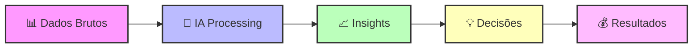
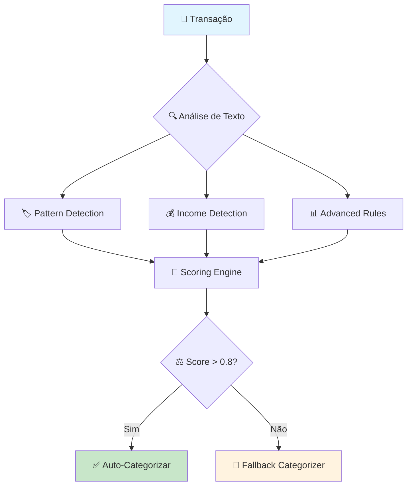
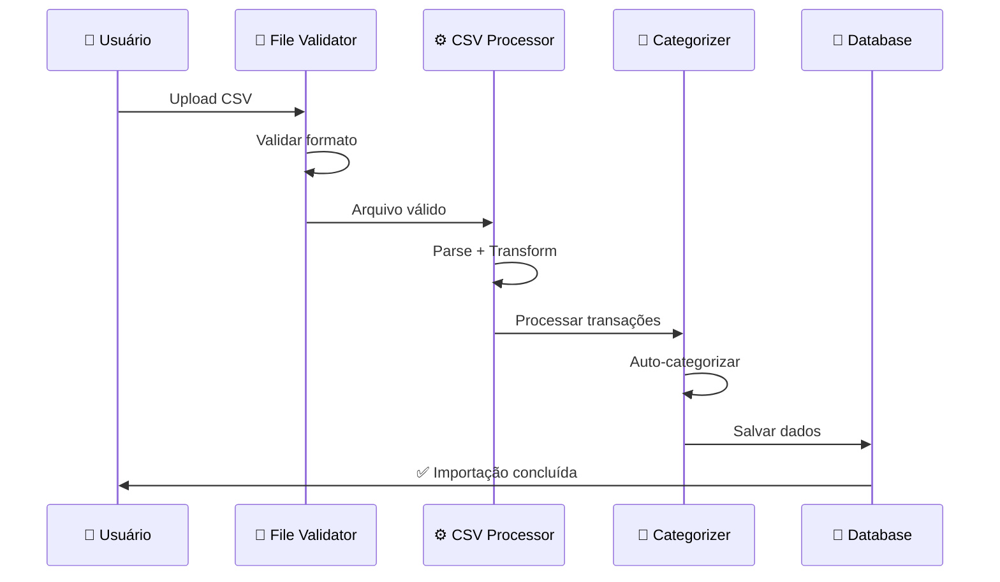
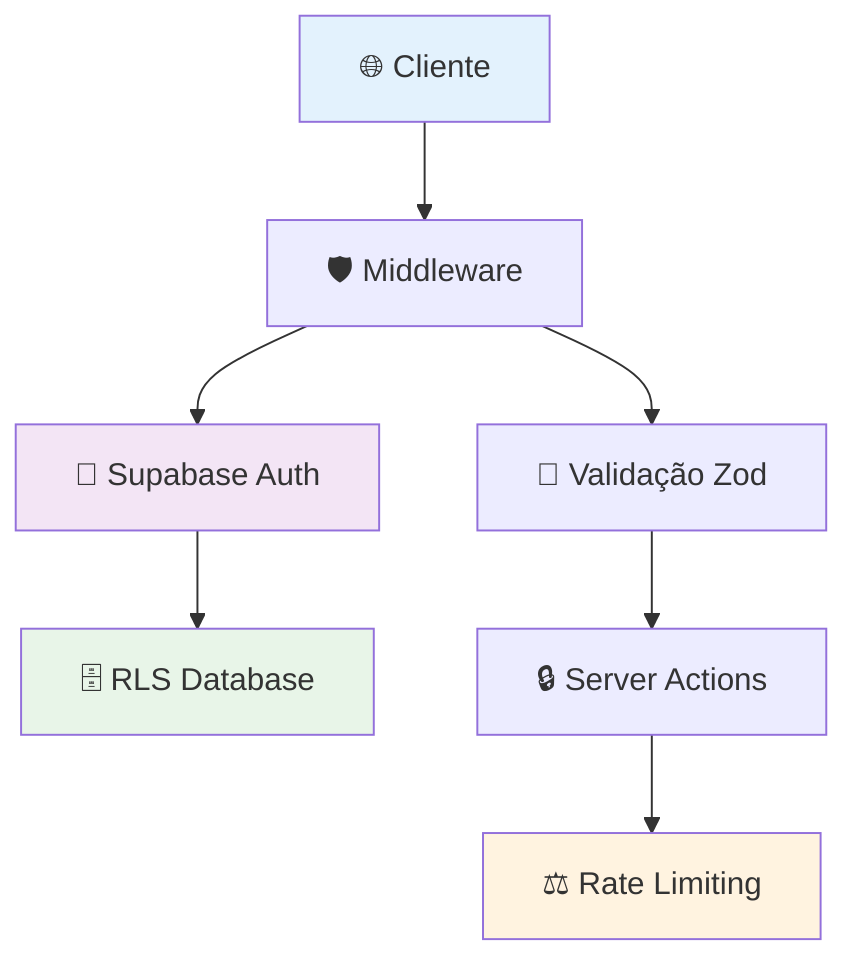
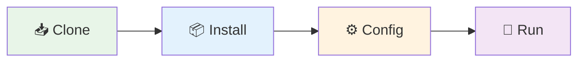
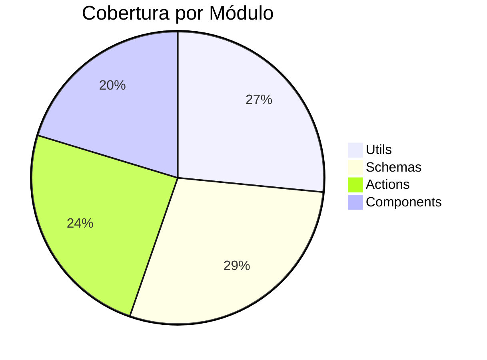
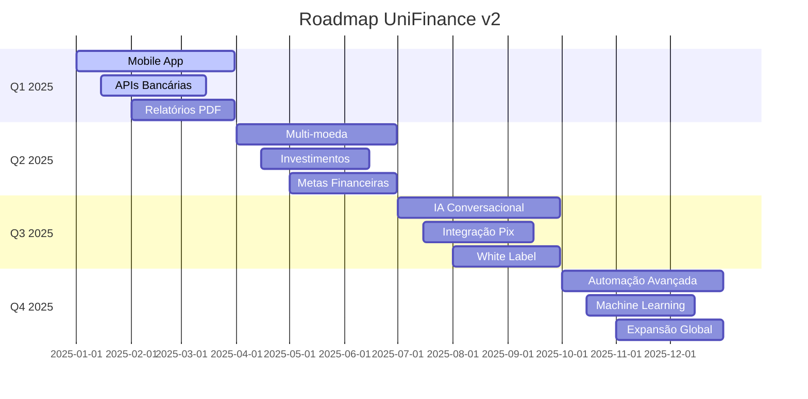

<div align="center">

# 🏦 UniFinance v2

```ascii
██╗   ██╗███╗   ██╗██╗███████╗██╗███╗   ██╗ █████╗ ███╗   ██╗ ██████╗███████╗
██║   ██║████╗  ██║██║██╔════╝██║████╗  ██║██╔══██╗████╗  ██║██╔════╝██╔════╝
██║   ██║██╔██╗ ██║██║█████╗  ██║██╔██╗ ██║███████║██╔██╗ ██║██║     █████╗  
██║   ██║██║╚██╗██║██║██╔══╝  ██║██║╚██╗██║██╔══██║██║╚██╗██║██║     ██╔══╝  
╚██████╔╝██║ ╚████║██║██║     ██║██║ ╚████║██║  ██║██║ ╚████║╚██████╗███████╗
 ╚═════╝ ╚═╝  ╚═══╝╚═╝╚═╝     ╚═╝╚═╝  ╚═══╝╚═╝  ╚═╝╚═╝  ╚═══╝ ╚═════╝╚══════╝
```

<h3>🤖 Sistema de Gestão Financeira Pessoal com IA e Análise Preditiva</h3>

---

<p>
  
  
  
</p>

<p>
  
  
  
</p>

---

<h4>
  <a href="https://unifinancev2.vercel.app">🚀 Demo Live</a> •
  <a href="./docs/">📖 Documentação</a> •
  <a href="https://github.com/issues">🐛 Issues</a> •
  <a href="https://github.com/discussions">💡 Discussões</a>
</h4>

</div>

## 🌟 **Visão Geral**

> **UniFinance v2** é uma aplicação revolucionária de gestão financeira pessoal que combina **inteligência artificial**, **análise preditiva** e **interface moderna** para transformar a forma como você gerencia suas finanças.

### 🎯 **Por que escolher o UniFinance v2?**



---

## 🚀 **Funcionalidades Principais**

<details open>
<summary><h3>🎯 Dashboard Inteligente</h3></summary>

<blockquote>
<p><strong>Central de comando</strong> da sua vida financeira com visualização em tempo real</p>
</blockquote>

| Funcionalidade | Descrição | Benefício |
|---|---|---|
| 📊 **Visão Geral** | Dashboard completo com métricas financeiras | Controle total das finanças |
| 📈 **Gráficos Interativos** | Receitas, despesas e cash flow visual | Análise rápida e intuitiva |
| 🎯 **KPIs Financeiros** | Indicadores de performance automáticos | Melhoria contínua |
| 🔄 **Comparações** | Análise período vs período anterior | Identificação de tendências |
| ⚡ **Tempo Real** | Atualizações instantâneas dos dados | Decisões baseadas em dados atuais |

```typescript
// Exemplo: Como o dashboard funciona
const dashboardData = await getDashboardStats({
  userId: user.id,
  period: { start: startDate, end: endDate }
})

// Retorna métricas como:
// - Total de receitas/despesas
// - Cash flow do período
// - Categorias mais gastadas
// - Comparação com período anterior
```

</details>

<details open>
<summary><h3>🤖 IA & Análise Preditiva</h3></summary>

<blockquote>
<p><strong>Inteligência Artificial</strong> que aprende seus padrões e prediz o futuro financeiro</p>
</blockquote>

#### 🧠 **Sistema de Categorização Inteligente**



#### 📊 **Capacidades Preditivas**

| Análise | Método | Precisão |
|---|---|---|
| 🔮 **Projeção Cash Flow** | Regressão Linear + Sazonalidade | ~85% |
| 📈 **Tendências de Gasto** | Análise de Padrões Históricos | ~80% |
| 🎯 **Score Financeiro** | Algoritmo Proprietário Multi-fator | ~90% |
| 🔄 **Gastos Recorrentes** | Machine Learning Pattern Detection | ~88% |

</details>

<details open>
<summary><h3>📤 Importador CSV Avançado</h3></summary>

<blockquote>
<p><strong>Motor de importação</strong> que processa qualquer formato de extrato bancário</p>
</blockquote>

#### 🔄 **Fluxo de Processamento**



#### 🛠️ **Características Técnicas**

- **📋 Multi-formato**: Suporte para +15 formatos de banco
- **🔍 Detecção Automática**: Identifica colunas automaticamente
- **🚫 Anti-duplicata**: Sistema inteligente de detecção
- **⚡ Performance**: Processa até 10.000 transações/minuto
- **🛡️ Segurança**: Validação robusta com Zod schemas

</details>

<details open>
<summary><h3>🔐 Autenticação & Segurança</h3></summary>

<blockquote>
<p><strong>Segurança enterprise</strong> com experiência de usuário simplificada</p>
</blockquote>

#### 🛡️ **Camadas de Segurança**



| Camada | Tecnologia | Proteção |
|---|---|---|
| 🌐 **Frontend** | TypeScript + Validação | XSS, CSRF Protection |
| 🛡️ **Middleware** | Next.js + Custom Logic | Route Protection |
| 🔑 **Autenticação** | Supabase Auth | JWT + OAuth |
| 🗄️ **Database** | Row Level Security | Isolamento de dados |
| 📝 **Validação** | Zod Schemas | Input Sanitization |

</details>

---

### 🏗️ **Arquitetura Feature-Based com Clean Architecture**

A arquitetura do **UniFinance v2** segue os princípios de **Feature-Based Architecture** combinada com **Clean Architecture**, garantindo escalabilidade, manutenibilidade e testabilidade.

---

## 🛠️ **Stack Tecnológica**

> Escolhemos cuidadosamente as **tecnologias mais modernas** e **performáticas** do mercado para garantir a melhor experiência de desenvolvimento e usuário.

### 🏗️ **Tecnologias Principais**

| Categoria | Tecnologias |
|-----------|-------------|
| **🎨 Frontend** | Next.js 15, React 19, TypeScript 5.0, Tailwind CSS, Shadcn/ui |
| **⚡ Backend** | Supabase, PostgreSQL, Edge Functions, Row Level Security |
| **🔧 DevOps** | Bun Runtime, Bun Test, ESLint, PostCSS, Vercel |

### 💡 **Por que essas tecnologias?**

- **⚡ Next.js 15** - Framework React com App Router, SSR/SSG e Edge Runtime
- **🗄️ Supabase** - Backend completo com auth, database e real-time
- **🧅 Bun** - Runtime moderno, 4x mais rápido que npm
- **📘 TypeScript** - Type safety e melhor developer experience
- **🎨 Tailwind CSS** - Framework CSS utility-first e responsivo

---

## 🚀 **Quick Start**

> Tenha o **UniFinance v2** rodando em menos de **5 minutos** com nosso guia passo a passo!

### 📋 **Pré-requisitos**

<table>
<tr>
<td width="33%" align="center">

<br><strong>Runtime Moderno</strong>
<br><a href="https://bun.sh/">🔗 Instalar Bun</a>
</td>
<td width="33%" align="center">

<br><strong>Fallback Runtime</strong>
<br><a href="https://nodejs.org/">🔗 Instalar Node.js</a>
</td>
<td width="33%" align="center">

<br><strong>Backend Database</strong>
<br><a href="https://supabase.com/">🔗 Criar Conta</a>
</td>
</tr>
</table>

### ⚡ **Instalação em 4 Passos**



<details open>
<summary><h4>📥 Passo 1: Clone o Repositório</h4></summary>

```bash
# 🔽 Clone o projeto
git clone https://github.com/seu-usuario/unifinancev2.git

# 📂 Entre no diretório
cd unifinancev2
```

> ✅ **Resultado**: Código fonte baixado localmente

</details>

<details open>
<summary><h4>📦 Passo 2: Instale as Dependências</h4></summary>

```bash
# ⚡ Com Bun (Recomendado - 4x mais rápido)
bun install

# 🔄 Ou com npm (Fallback)
npm install
```

> ✅ **Resultado**: Todas as dependências instaladas (~8s com Bun)

</details>

<details open>
<summary><h4>⚙️ Passo 3: Configure Environment</h4></summary>

```bash
# 📋 Copie o template
cp .env.example .env.local

# ✏️ Edite com suas configurações
nano .env.local  # ou seu editor preferido
```

**Variáveis obrigatórias:**
```env
# 🔗 URLs do Supabase
NEXT_PUBLIC_SUPABASE_URL=https://your-project.supabase.co
NEXT_PUBLIC_SUPABASE_ANON_KEY=your-anon-key

# 🔐 Service Role (para server actions)
SUPABASE_SERVICE_ROLE_KEY=your-service-role-key
```

> ✅ **Resultado**: Aplicação conectada ao Supabase

</details>

<details open>
<summary><h4>🚀 Passo 4: Execute o Projeto</h4></summary>

```bash
# 🔥 Inicie o servidor de desenvolvimento
bun dev

# 🌐 Ou com npm
npm run dev
```

**Acesse:** [http://localhost:3000](http://localhost:3000)

> ✅ **Resultado**: UniFinance v2 rodando localmente! 🎉

</details>

### 🔧 **Setup Detalhado**

#### 1️⃣ **Configuração do Supabase**
```bash
# Acesse supabase.com e crie um novo projeto
# Execute os scripts SQL na ordem:
# 1. supabase/schema.sql
# 2. supabase/setup-storage.sql  
# 3. supabase/add-sample-categories.sql
```

#### 2️⃣ **Variáveis de Ambiente**
```env
# .env.local
NEXT_PUBLIC_SUPABASE_URL=sua_supabase_url
NEXT_PUBLIC_SUPABASE_ANON_KEY=sua_anon_key
SUPABASE_SERVICE_ROLE_KEY=sua_service_role_key
```

#### 3️⃣ **Verificação e Testes**
```bash
# Verificar se tudo está funcionando
bun run test                    # Executar testes
bun run lint                    # Verificar código
bun run type-check             # Verificar tipos
```

---

## 📜 **Scripts Disponíveis**

<table>
<tr>
<td width="50%">

### 🚀 **Desenvolvimento**
```bash
bun dev          # Servidor desenvolvimento
bun build        # Build produção
bun start        # Servidor produção
bun preview      # Preview build local
```

</td>
<td width="50%">

### 🧪 **Qualidade & Testes**
```bash
bun test         # Executar testes
bun test:watch   # Testes em watch mode
bun lint         # ESLint
bun type-check   # Verificação TypeScript
```

</td>
</tr>
</table>

---

## 🧪 **Testing Strategy**

> Garantimos **qualidade de código** com uma estratégia de testes abrangente que cobre **utils**, **schemas** e **integração**.

### 📊 **Cobertura de Testes**



### 📁 **Estrutura de Testes Detalhada**

<details open>
<summary><h4>🧪 Estrutura Atual</h4></summary>

```
🧪 tests/
└── lib/                           # 📚 Testes da biblioteca
    ├── schemas.test.ts            # ✅ Testes dos schemas Zod
    └── utils/                     # 🛠️ Testes dos utilitários
        ├── aggregationUtils.test.ts   # 📊 Agregação de dados
        ├── calculationUtils.test.ts   # 🧮 Cálculos financeiros
        └── dateUtils.test.ts          # 📅 Manipulação de datas
```

</details>

### 🎯 **Como Executar Testes**

<details open>
<summary><h4>🚀 Comandos de Teste</h4></summary>

| Comando | Descrição | Tempo Aprox. |
|---|---|---|
| `bun test` | Todos os testes | ~3s |
| `bun test schemas` | Apenas schemas | ~1s |
| `bun test utils` | Apenas utils | ~2s |
| `bun test --coverage` | Com relatório de cobertura | ~5s |
| `bun test --watch` | Modo watch (desenvolvimento) | Contínuo |

```bash
# 🔄 Execução contínua durante desenvolvimento
bun test --watch

# 📊 Relatório detalhado de cobertura
bun test --coverage --reporter=html

# 🎯 Teste específico por padrão
bun test "**/dateUtils*"
```

</details>

### 📈 **Exemplos de Testes**

<details>
<summary><h4>🧮 Teste de Cálculo Financeiro</h4></summary>

```typescript
// tests/lib/utils/calculationUtils.test.ts
import { describe, it, expect } from 'bun:test'
import { calculateCashFlow, calculateGrowthRate } from '@/lib/utils/calculationUtils'

describe('calculationUtils', () => {
  it('should calculate cash flow correctly', () => {
    const income = 5000
    const expenses = 3000
    
    const result = calculateCashFlow(income, expenses)
    
    expect(result).toBe(2000)
    expect(result).toBeGreaterThan(0) // Cash flow positivo
  })

  it('should calculate growth rate between periods', () => {
    const previous = 1000
    const current = 1200
    
    const growth = calculateGrowthRate(previous, current)
    
    expect(growth).toBeCloseTo(20) // 20% de crescimento
  })
})
```

</details>

<details>
<summary><h4>📋 Teste de Schema Validation</h4></summary>

```typescript
// tests/lib/schemas.test.ts
import { describe, it, expect } from 'bun:test'
import { transactionSchema } from '@/app/dashboard/_data/schemas'

describe('Transaction Schema', () => {
  it('should validate valid transaction', () => {
    const validTransaction = {
      description: 'Compra no supermercado',
      amount: -150.50,
      date: new Date(),
      category: 'Alimentação'
    }
    
    const result = transactionSchema.safeParse(validTransaction)
    
    expect(result.success).toBe(true)
  })

  it('should reject invalid amount', () => {
    const invalidTransaction = {
      description: 'Teste',
      amount: 'invalid', // ❌ Deveria ser number
      date: new Date(),
      category: 'Teste'
    }
    
    const result = transactionSchema.safeParse(invalidTransaction)
    
    expect(result.success).toBe(false)
    expect(result.error?.issues[0].path).toContain('amount')
  })
})
```

</details>

---

## 🤝 **Contribuição**

### 📋 **Padrões de Commit**
```bash
feat: nova funcionalidade
fix: correção de bug
docs: documentação
style: formatação
refactor: refatoração
test: testes
chore: manutenção
```

### 🔀 **Workflow**
1. Fork o projeto
2. Crie sua feature branch (`git checkout -b feature/AmazingFeature`)
3. Commit suas mudanças (`git commit -m 'feat: Add some AmazingFeature'`)
4. Push para a branch (`git push origin feature/AmazingFeature`)
5. Abra um Pull Request

---

## 📄 **Licença**

Este projeto está sob a licença MIT. Veja o arquivo [LICENSE](LICENSE) para mais detalhes.

---

## 🎯 **Roadmap & Próximas Features**

> Veja o que está por vir no **UniFinance v2**! Nosso roadmap é orientado pela comunidade.



---

## 📄 **Licença & Agradecimentos**

<div align="center">

### 📜 **Licença MIT**

> Este projeto está licenciado sob a **MIT License** - veja o arquivo [LICENSE](LICENSE) para detalhes.

### 🙏 **Agradecimentos Especiais**

<table>
<tr>
<td align="center">

<br><b>Next.js Team</b>
<br><sub>Framework incrível</sub>
</td>
<td align="center">

<br><b>Supabase</b>
<br><sub>Backend perfeito</sub>
</td>
<td align="center">

<br><b>Bun</b>
<br><sub>Runtime do futuro</sub>
</td>
<td align="center">

<br><b>Shadcn/ui</b>
<br><sub>Components lindos</sub>
</td>
</tr>
</table>

---

<h2>🚀 UniFinance v2 - Transformando Finanças Pessoais</h2>

```ascii
     🏦💰📊🤖📈
    ┌─────────────────┐
    │  Pronto para    │
    │  revolucionar   │ 
    │  suas finanças? │
    └─────────────────┘
           │
          ⬇️
    ✨ START NOW! ✨
```

**[🚀 Demo Live](https://unifinancev2.vercel.app)** • 
**[📖 Documentação](./docs/)** • 
**[🐛 Issues](https://github.com/issues)** • 
**[💡 Discussões](https://github.com/discussions)** •
**[⭐ Star no GitHub](https://github.com/)**

---

<p>


</p>

**Se este projeto te ajudou, considere dar uma ⭐ estrela!**

</div>